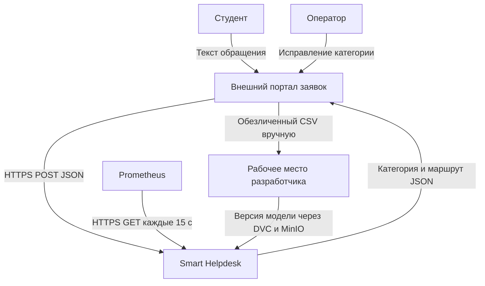
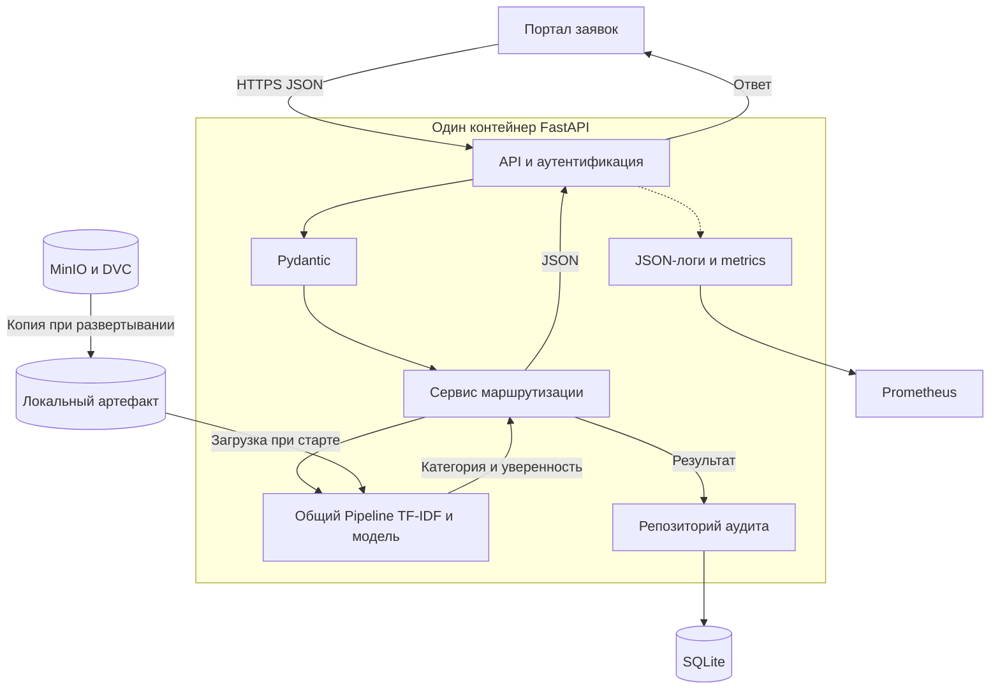

# Лабораторная работа 2

Умная маршрутизация обращений студентов

Репозиторий: https://github.com/andr4352/ai-system-smart-helpdesk


## 1. Инициализация проекта

Цель работы — спроектировать AI-систему, которая определяет тему обращения студента и предлагает подразделение для его обработки. Выбран трек 4 «Служба поддержки и умная маршрутизация обращений». Проект называется ai-system-smart-helpdesk.

Эту тему выбрал из-за простой реализации: входные данные — текст, результат — одна категория. Для первой модели достаточно TF-IDF и логистической регрессии на CPU. Не нужны генерация ответов, видеопоток и платные внешние API.

Подготовлен локальный Git-репозиторий: README.md, лицензия MIT, .gitignore для Python, каркас app/, tests/, схемы в docs/ и три файла docs/adr/. Dockerfile и GitHub Actions включены в проект. Создан публичный репозиторий GitHub: https://github.com/andr4352/ai-system-smart-helpdesk.

| Каталог или файл | Содержимое |
|---|---|
| app/api | Маршруты и Pydantic-схемы |
| app/core | Проверка API-ключа |
| app/data | Место для подготовки обучающих данных |
| app/ml | Предобработка и интерфейс загрузчика |
| app/services | Правила выбора подразделения |
| app/repositories | Запись результатов в SQLite |
| docs и docs/adr | Архитектура, Mermaid и ADR-01–03 |
| tests и .github/workflows | Проверки контракта и CI |
| README.md, LICENSE, .gitignore | Отчет, MIT и исключения Git |

## 2. Проблема, границы системы и требования

Проблема: оператор вручную читает обращения и выбирает исполнителя. Повторяющиеся вопросы о доступе, учебе и оплате занимают время. Система предлагает категорию и маршрут; сомнительные обращения остаются оператору. Пользователи — студент, оператор поддержки и администратор сервиса. Результат получает существующий портал заявок.

| Категория | Пример | Маршрут |
|---|---|---|
| ACCOUNT | Не могу войти в личный кабинет | IT — техническая поддержка |
| STUDY | Где получить справку об обучении | DEAN_OFFICE — деканат |
| PAYMENT | Не отобразилась оплата обучения | FINANCE — финансовый отдел |
| OTHER | Вопрос вне трех основных тем | OPERATOR — оператор |

Основная задача ИИ — многоклассовая классификация текста с обучением по размеченным примерам. Дополнительная операция — оценка уверенности в выбранном классе. Отдельная вспомогательная ML-модель не нужна. TF-IDF переводит текст в числовые признаки, логистическая регрессия оценивает категории. confidence — максимальная оценка predict_proba, а не гарантия правильности ответа [1].

Сценарии: 1) студент отправляет текст через портал, сервис возвращает категорию; 2) при confidence < 0,8 или категории OTHER портал передает обращение оператору; 3) оператор исправляет неверную категорию в портале; 4) администратор проверяет готовность сервиса и метрики. При недоступности модели портал сохраняет заявку без автоматического назначения.

В границы системы входят валидация, предобработка, инференс, выбор маршрута, аудит, REST API и мониторинг. Сам портал, учетные записи студентов, хранение исходной переписки и работа подразделений находятся вне системы. Генерация ответов, обработка вложений и автоматическое решение вопроса не предусмотрены.

Плановые показатели: сократить медианное время первичной сортировки минимум на 50% относительно ручной сортировки на сопоставимом наборе заявок; автоматически направлять не менее 60% обращений. Качество: macro-F1 ≥ 0,80 на отложенной выборке и доля правильных назначений среди автоматических ≥ 0,90. Macro-F1 усредняет F1 по четырем классам. Дополнительно проверяется recall каждого класса. Это цели, а не результаты проведенного обучения.

Плановый SLA: p95 полного ответа ≤ 500 мс при 5 запросах в секунду; p95 инференса ≤ 150 мс; доступность ≥ 99% за месяц. Условия проверки: CPU с 2 ядрами, 4 ГБ ОЗУ, прогретая модель, тексты до 3000 символов. Нагрузку проверяем отдельным десятиминутным тестом; доступность считаем по периодическим проверкам /health.

| Код | Требование | Критерий приемки |
|---|---|---|
| FR-01 | Прием обращения | Валидный POST возвращает JSON по схеме |
| FR-02 | Проверка входа | Неверное поле или JSON: 422 с указанием места ошибки |
| FR-03 | Ручная обработка | confidence < 0,8 или OTHER: manual_review_required=true |
| FR-04 | Аудит | Сохранены request_id, категория, маршрут и версия модели |
| NFR-01 | Скорость | p95 ответа ≤ 500 мс при 5 запросах/с |
| NFR-02 | Воспроизводимость | Версия модели и request_id есть в каждом успешном ответе |
| NFR-03 | Доступ | Нет или неверен X-API-Key: 401 |
| NFR-04 | Готовность | Нет модели или БД: /health возвращает 503 |

## 3. Контекстная диаграмма и потоки данных



| Поток | Протокол и формат | Частота |
|---|---|---|
| Студент и оператор → портал | HTTPS; текст формы или исправленная категория | При отправке или исправлении |
| Портал ↔ Smart Helpdesk | HTTPS; JSON запроса и результата | Один вызов на обращение |
| Prometheus → Smart Helpdesk | HTTPS GET /metrics; OpenMetrics | Каждые 15 секунд |
| Портал → разработчик | Ручная выгрузка обезличенного CSV UTF-8 | Раз в неделю |
| Разработчик → хранилище → сервис | DVC/MinIO по HTTPS; Pipeline и JSON-манифест | При выпуске версии |

Рабочий поток: портал убирает персональные сведения и присваивает технический item_id. API проверяет ключ и схему. Общий Pipeline нормализует текст, строит TF-IDF-вектор и вычисляет оценки классов. Сервис выбирает маршрут, сохраняет результат в SQLite и возвращает JSON. Внутри приложения используются вызовы Python; запись в SQLite идет через sqlite3. Текст не записывается в журналы.

Контур данных: CSV содержит item_id, text, label. Перед обучением проверяются пропуски, длина текста, допустимые метки и дубликаты. Для начала планируется не менее 400 вручную размеченных примеров, по 100 на класс. Это стартовый объем, его достаточность проверяется по качеству. Реальных данных в текущей работе нет. Шаблонные примеры допустимы для отладки, но не доказывают качество на настоящих обращениях.

Данные делятся на train/validation/test в долях 70/15/15 с сохранением долей классов. Дубликаты удаляются до разбиения; связанные обращения остаются в одной части. TF-IDF обучается только на train, порог проверяется на validation, итоговые метрики считаются один раз на test. Код хранится в Git, данные и модель — через DVC в MinIO.

Контур модели: сохраняется единый Pipeline с нормализацией, TF-IDF и классификатором. manifest.json содержит model_version, версии Python и библиотек, Git-коммит, версию данных, порог 0,8, метрики и SHA-256 артефакта. При развертывании нужная версия скачивается в локальный каталог, проверяется и один раз загружается в память. Это предотвращает расхождение предобработки при обучении и работе сервиса.

## 4. Компоненты и архитектурный стиль

Выбран модульный монолит: FastAPI, модель и прикладные правила работают в одном Docker-контейнере. SQLite подключается как файл на постоянном томе. MinIO хранит версии вне контейнера, Prometheus собирает метрики. Такое разделение оставляет четыре контура — данные, модель, приложение и эксплуатацию — без отдельных микросервисов для каждого модуля.



| Компонент | Вход → выход | Назначение и средства |
|---|---|---|
| API и доступ | HTTP → вызов сервиса | FastAPI, Uvicorn; маршрутизация, X-API-Key |
| Validation | JSON → объект запроса | Pydantic; типы, длина, лишние поля |
| Preprocessing | Текст → разреженный вектор | Общая нормализация и TF-IDF; scikit-learn |
| Inference | Вектор → оценки классов | Логистическая регрессия; ModelLoader |
| Business Logic | Класс и confidence → маршрут | Python; порог 0,8 и ручная проверка |
| Storage | Результат → запись аудита | sqlite3; SQLite на постоянном томе |
| Model Storage | Версия → Pipeline | DVC, MinIO, локальная копия |
| Observability | События → логи и метрики | JSON, prometheus-client, Prometheus |

Сервис маршрутизации вызывает модель и репозиторий через отдельные модули. API не обучает модель и не обращается к MinIO на каждый запрос. В будущем модель можно заменить без изменения формата ответа порталу.

## 5. Контракты REST API

Основной метод — POST /api/v1/predict. Заголовки: Content-Type: application/json и X-API-Key: <секрет>. Все три эндпоинта требуют ключ. item_id — технический номер заявки вида TKT-42, он не является признаком модели. text — строка от 10 до 3000 символов после удаления пробелов по краям. Лишние поля запрещены [2].

```python
from typing import Literal
from uuid import UUID
from pydantic import BaseModel, ConfigDict, Field

Category = Literal["ACCOUNT", "STUDY", "PAYMENT", "OTHER"]

class PredictionRequest(BaseModel):
    model_config = ConfigDict(
        extra="forbid", str_strip_whitespace=True
    )
    item_id: str = Field(
        strict=True, pattern=r"^TKT-[0-9]{1,10}$"
    )
    text: str = Field(strict=True, min_length=10, max_length=3000)

class PredictionResponse(BaseModel):
    request_id: UUID
    item_id: str
    prediction: Category
    confidence: float = Field(ge=0, le=1)
    route: Literal["IT", "DEAN_OFFICE", "FINANCE", "OPERATOR"]
    model_version: str
    manual_review_required: bool

class HealthResponse(BaseModel):
    status: Literal["healthy", "not_ready"]
    model_loaded: bool
    database_ready: bool
    model_version: str | None
    uptime_seconds: float = Field(ge=0)

```

Пример запроса:

```text
{
  "item_id": "TKT-42",
  "text": "Не могу войти в личный кабинет после смены пароля."
}
```

Пример успешного ответа 200. Число 0,91 показано для иллюстрации контракта, это не результат обучения:

```text
{
  "request_id": "9b1deb4d-3b7d-4bad-9bdd-2b0d7b3dcb6d",
  "item_id": "TKT-42",
  "prediction": "ACCOUNT",
  "confidence": 0.91,
  "route": "IT",
  "model_version": "1.0.0",
  "manual_review_required": false
}
```

При confidence = 0,63 категория сохраняется как предложение модели, но route = OPERATOR и manual_review_required = true. Категория OTHER всегда требует оператора. При confidence = 0,80 разрешено автоматическое назначение для остальных трех категорий.

| Метод | Успех | Ошибка или особенность |
|---|---|---|
| POST /api/v1/predict | 200; PredictionResponse | 401 ключ; 422 данные; 503 модель не готова |
| GET /health | 200; HealthResponse | 503, если модель или SQLite не готовы |
| GET /metrics | 200; OpenMetrics | 401 при неверном ключе; закрыт от публичного доступа |

Ошибки схемы и синтаксиса JSON возвращаются с кодом 422 в формате FastAPI: detail — список объектов с loc, msg и type. Поле input удаляется из ошибок в целевой версии, чтобы не отражать текст обращения; в каркасе используется стандартный обработчик FastAPI [3]. Ошибки доступа и готовности возвращают detail со строковым кодом.

```text
{"detail": "MODEL_NOT_READY"}

{"detail": [{"loc": ["body", "text"],
  "msg": "String should have at least 10 characters",
  "type": "string_too_short"}]}
```

Пример /health при готовом сервисе:

```text
{"status": "healthy", "model_loaded": true,
 "database_ready": true, "model_version": "1.0.0",
 "uptime_seconds": 3600.0}
```

Проверка готовности включает загрузку модели и запрос к таблице SQLite. Если модель не загружена, status = not_ready, model_loaded = false, model_version = null, HTTP 503. /metrics остается доступным для диагностики. Целевой формат метрик — application/openmetrics-text; размерности: секунды для времени и количество для счетчиков.

## 6. Архитектурные решения ADR

ADR-01. Синхронный REST API. Дата: 20.09.2026. Статус: принято для проекта.

Контекст: Портал передает одно короткое обращение и сразу ожидает категорию. Потоковой обработки нет. Решение: Использовать синхронный POST /api/v1/predict.

Обоснование: REST проще проверить через Swagger. Очередь сообщений потребовала бы брокера, отдельного обработчика и запроса статуса. Последствия: Результат возвращается в одном ответе. При перегрузке запрос отклоняется; портал сохраняет обращение для ручной обработки. При росте задержек можно добавить очередь.

ADR-02. Хранение и версии моделей. Дата: 20.09.2026. Статус: принято для проекта.

Контекст: Нужно воспроизводить результат и откатывать модель вместе с ее предобработкой. Бинарные файлы увеличивают историю Git. Решение: Хранить Pipeline в MinIO, версии данных и артефактов учитывать через DVC. В Git хранить код, DVC-указатели и manifest.json.

Обоснование: DVC связывает коммит с конкретными данными и моделью. MinIO работает локально; отдельный MLflow для первой версии не требуется. Последствия: Нужны резервная копия MinIO и доступ к нему при развертывании. Сервис использует проверенную локальную копию, поэтому сбой MinIO не останавливает уже запущенный инференс. joblib загружает только доверенные артефакты.

ADR-03. Модульный монолит. Дата: 20.09.2026. Статус: принято для проекта.

Контекст: Проект разрабатывает один студент. Модель небольшая и работает на CPU. Решение: Разместить API, модель и правила в одном Docker-контейнере, разделив код на модули.

Обоснование: Монолит проще запускать и отлаживать. Микросервисы добавили бы сетевые вызовы и отдельные настройки развертывания. Последствия: Все модули выпускаются вместе. SQLite ограничивает параллельную запись; при заметном росте нагрузки сначала перейти на PostgreSQL, затем при необходимости выделить инференс.

## 7. Безопасность, наблюдаемость и устойчивость

Доступ: ключ передается только в X-API-Key по HTTPS и хранится в переменной окружения API_KEY. Ключ не включается в Git, образ Docker и логи. Для локальной проверки используется HTTP на localhost; при внешнем размещении TLS завершает обратный прокси. /metrics разрешен только узлу мониторинга, /health — проверяющему узлу. Для разных клиентов предусматриваются отдельные ключи с возможностью замены.

Ограничения целевого развертывания: тело запроса до 2 МБ, текст до 3000 символов, тайм-аут 5 секунд и до 600 запросов в минуту на ключ. Прокси возвращает 413 при превышении размера, 429 при превышении частоты, 504 при тайм-ауте. Схемы Pydantic блокируют неверные типы и поля. Эти меры ограничивают обычные перегрузки; для защиты от распределенной атаки нужна защита у провайдера.

Персональные данные: учебная версия использует только вымышленные обращения без ФИО, телефонов и документов. Для реального внедрения оператор должен определить цель и правовое основание обработки по 152-ФЗ, права доступа и сроки хранения [4]. Портал удаляет персональные сведения до передачи модели. Маскировка телефона и почты сама по себе не гарантирует обезличивание: свободный текст проверяется отдельно. Замена идентификатора также не означает полного обезличивания.

В журнале аудита хранятся request_id, технический item_id, время, категория, confidence, маршрут, model_version и признак ручной обработки. Исходный текст и API-ключ не сохраняются. Плановый срок хранения аудита — 30 дней с последующим удалением; доступ — только администратору. Файл БД и резервные копии размещаются на защищенном томе. HTTP-логи содержат запись и для неуспешных запросов.

```text
{"timestamp":"2026-09-20T12:00:00Z","level":"INFO",
 "request_id":"9b1deb4d-3b7d-4bad-9bdd-2b0d7b3dcb6d",
 "item_id":"TKT-42","latency_ms":24.5,"status":200,
 "prediction":"ACCOUNT","model_version":"1.0.0"}
```

В целевой версии request_id создается при входе, попадает в X-Request-ID ответа, журнал и запись БД. Для успешного прогноза тот же идентификатор включается в JSON. Так можно связать получение запроса, вызов модели и запись результата. Пример времени выше иллюстрирует формат, а не измеренную производительность.

| Метрика | Назначение |
|---|---|
| http_requests_total | Число запросов по маршруту, методу и коду ответа |
| http_request_duration_seconds | Гистограмма полного времени ответа |
| model_inference_duration_seconds | Гистограмма времени работы Pipeline |
| manual_review_total | Число обращений, переданных оператору |
| model_loaded | 1 при загруженной модели, иначе 0 |

request_id и item_id не добавляются в метки Prometheus, чтобы не создавать отдельный ряд на каждую заявку. Плановые сигналы: доля 5xx > 5% за 5 минут, p95 > 500 мс за 5 минут или /health не готов три проверки подряд. Prometheus опрашивает сервис каждые 15 секунд; администратор проверяет сигналы в интерфейсе мониторинга.

Data Drift — изменение входных данных. Раз в неделю сравниваем длину текста, долю неизвестных слов и распределение предсказанных категорий с обучающей выборкой. Храним обезличенные числовые характеристики, а не исходную переписку. Для длины и доли неизвестных слов рассчитываем PSI по фиксированным интервалам; PSI > 0,2 — повод проверить данные, а не автоматическое доказательство ухудшения. Отчеты можно строить через Evidently.

Concept Drift — изменение связи текста с правильной категорией. Его проверяем по размеченным оператором свежим обращениям, включая случайную выборку автоматически назначенных заявок. Если macro-F1 < 0,80 или качество падает более чем на 0,05 относительно принятой версии, разбираем ошибки и готовим переобучение. Без правильных меток concept drift надежно подтвердить нельзя.

Устойчивость: при ошибке модели или записи аудита успешный ответ не выдается; портал оставляет заявку оператору. Новая модель сначала проверяется на validation и test, затем запускается с проверкой /health. Предыдущая версия Pipeline и образа сохраняется для отката. Резервная копия SQLite выполняется штатным backup-механизмом; простое копирование активного файла не используется.

CI/CD: при push или pull request запускаются проверки схем и маршрутизации, затем сборка Docker. После обучения добавляются проверка метрик, контроль SHA-256 и загрузка артефакта через DVC. Развертывание выполняется отдельно после успешных проверок; автоматическая замена рабочей модели по одному факту push не предусмотрена.

## 8. Подготовка отчета и публикация

В README.md собраны разделы 1–8, диаграммы записаны в Mermaid и вынесены в docs/context.mmd и docs/components.mmd. Решения ADR сохранены отдельными файлами. В Git исключены веса моделей, .env, виртуальное окружение, временные файлы и рабочая БД.

В каркасе реализованы схемы, проверка ключа, правила порога, запись успешного ответа в SQLite и три маршрута. ModelLoader оставлен заглушкой, как предусмотрено заданием: без модели /predict и /health возвращают 503. Обученная модель, DVC/MinIO, JSON-мониторинг всех запросов, ограничения прокси и анализ дрейфа описаны как проектируемые части, а не как уже работающая инфраструктура.

Проект опубликован в публичном репозитории [https://github.com/andr4352/ai-system-smart-helpdesk](https://github.com/andr4352/ai-system-smart-helpdesk). Исходный код, схемы Mermaid, README и ADR доступны в ветке main.

Для локального запуска:

```bash
git clone https://github.com/andr4352/ai-system-smart-helpdesk.git
cd ai-system-smart-helpdesk
```

Дальнейшие команды приведены в [START.md](START.md).

## 9. Контрольные вопросы

1. Чем AI-система отличается от обычной веб-системы?
Кроме API и хранения, нужны данные для обучения, версии моделей, одинаковая предобработка и контроль качества прогнозов.

2. Что такое Train-Serving Skew и как его избежать?
Это различие обработки данных при обучении и работе. Сохраняем и используем один Pipeline с тем же словарем и преобразованиями.

3. Когда выбирать монолит, а когда микросервисы?
Монолит удобен для небольшой команды и нагрузки. Отдельный сервис модели нужен при независимом масштабировании, тяжелом GPU-инференсе или разных циклах выпуска.

4. Зачем нужен Pydantic?
Он проверяет структуру и ограничения входных данных и описывает схему API. Правильность смысла обращения он не проверяет.

5. Почему веса моделей не хранят в Git?
Большие бинарные версии раздувают историю и плохо сравниваются. Git хранит код и указатели, DVC/MinIO — сами артефакты.

6. Что такое ADR?
Короткая запись архитектурного решения: дата, статус, контекст, решение, обоснование и последствия. Она объясняет, почему выбран конкретный вариант.

7. Чем Data Drift отличается от Concept Drift?
Первый — изменение входных данных, второй — связи признаков с правильным ответом. Модуль мониторинга сравнивает распределения, а offline-оценка использует новые правильные метки.

8. Почему для /health мало всегда возвращать 200?
Процесс может работать без модели или БД. Проверяем обе зависимости и при неготовности возвращаем 503.

9. Как защититься от неверного ввода?
Проверять API-ключ, типы, длину и лишние поля; ограничить размер, частоту и время запроса. Не сохранять сырой текст в ошибках и логах.

10. Как проследить запрос через всю систему?
Создать request_id на входе и передать его в обработчик, вызов модели, аудит и ответ. По нему сопоставляются события.

## 10. Вывод

Спроектирована система маршрутизации обращений студентов. Определены четыре категории, правила ручной проверки, требования, компоненты, потоки данных и API. Выбран модульный монолит с моделью TF-IDF и логистической регрессией. Подготовлен каркас проекта для следующих лабораторных работ; обучение и проверка целевых метрик выполняются на следующих этапах.

## 11. Использованные источники

Методические указания к лабораторной работе № 2 «Проектирование архитектуры программной системы искусственного интеллекта».

[1] scikit-learn. Feature extraction. https://scikit-learn.org/stable/modules/feature_extraction.html

[2] Pydantic. Models. https://docs.pydantic.dev/latest/concepts/models/

[3] FastAPI. Handling Errors. https://fastapi.tiangolo.com/tutorial/handling-errors/

[4] Федеральный закон от 27.07.2006 № 152-ФЗ «О персональных данных». https://www.consultant.ru/document/cons_doc_LAW_61801/

Дата обращения к электронным источникам: 20.09.2026.
