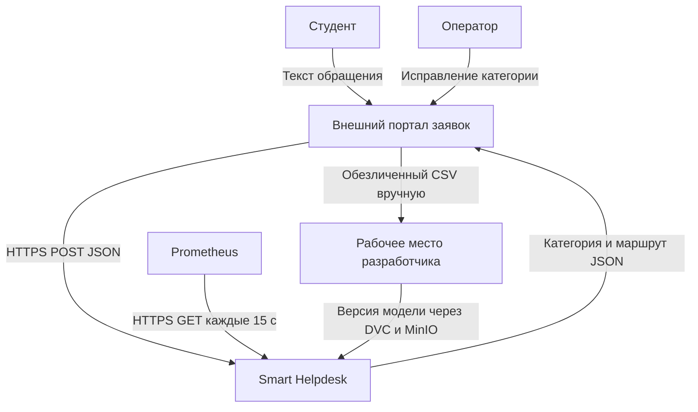
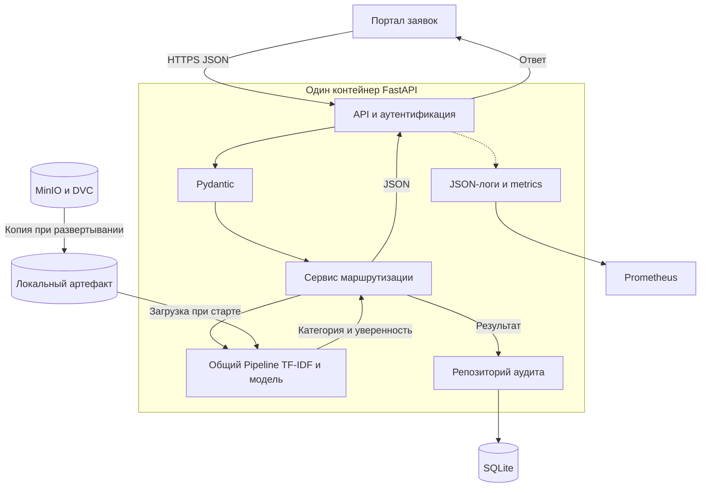

# Лабораторная работа 2

Умная маршрутизация обращений студентов

## 1. Цель работы и инициализация проекта

Цель — спроектировать классификацию и маршрутизацию обращений студентов. Выбран трек 4: простая модель на CPU, без платных AI-сервисов.

В публичном репозитории созданы README, .gitignore для Python, MIT, каркас app/, тесты и архитектурные схемы. Ссылка — в разделе 8.

## 2. Проблема, границы и требования

Оператор тратит время на ручную сортировку заявок. Сервис предлагает категорию и маршрут, а сомнительные случаи оставляет человеку. Студент отправляет текст через внешний портал; оператор исправляет ошибки; администратор следит за работой сервиса.

| Категория | Пример обращения | Куда направить |
|---|---|---|
| ACCOUNT | Не могу войти в личный кабинет | IT — техподдержка |
| STUDY | Нужна справка об обучении | DEAN_OFFICE — деканат |
| PAYMENT | Не отобразилась оплата | FINANCE — финансовый отдел |
| OTHER | Вопрос вне основных тем | OPERATOR — оператор |

Задача ИИ — многоклассовая классификация текста. TF-IDF переводит слова в числа, логистическая регрессия оценивает классы. Дополнительная операция — расчет уверенности confidence. Если она ниже 0,8 или выбран OTHER, нужна ручная проверка. Отдельная вспомогательная модель не требуется.

В систему входят API, проверка данных, прогноз, выбор маршрута, аудит и мониторинг. За ее пределами — портал, учетные записи, исходная переписка и работа подразделений. Сервис не отвечает на вопросы и не обрабатывает вложения.

Плановые цели: сократить медианное время сортировки на 50% относительно ручной обработки; автоматически направлять ≥ 60% заявок; получить macro-F1 ≥ 0,80 и ≥ 90% правильных автоматических назначений на отложенных данных. Это требования, а не измеренные результаты.

| Код | Требование | Критерий приемки |
|---|---|---|
| FR-01 | Принимать JSON через POST | 200 и ответ по схеме |
| FR-02 | Отклонять неверный ввод | 422 с указанием поля |
| FR-03 | Передавать сомнения оператору | confidence < 0,8 или OTHER: ручная проверка |
| FR-04 | Сохранять аудит | Идентификаторы, результат и версия записаны |
| NFR-01 | Обеспечить скорость | p95 ответа ≤ 500 мс; инференса ≤ 150 мс |
| NFR-02 | Обеспечить воспроизводимость | request_id и model_version в ответе |
| NFR-03 | Проверять доступ | Неверный или отсутствующий ключ: 401 |
| NFR-04 | Проверять готовность | Нет модели или БД: /health → 503 |

SLA проверяется при 5 запросах/с, текстах до 3000 символов, CPU с 2 ядрами и 4 ГБ ОЗУ. Нагрузочный тест — 10 минут после прогрева. Целевая доступность — 99% за месяц по проверкам /health.

## 3. Контекстная диаграмма и потоки данных



| Поток | Протокол и формат | Частота |
|---|---|---|
| Пользователь ↔ портал | HTTPS, текст формы и категория | При отправке или исправлении |
| Портал ↔ сервис | HTTPS, JSON запроса и ответа | На каждую заявку |
| Prometheus → сервис | HTTPS GET, OpenMetrics | Каждые 15 секунд |
| Портал → разработчик | Выгрузка обезличенного CSV | Раз в неделю |
| Хранилище → сервис | HTTPS, DVC/MinIO, Pipeline и JSON | При выпуске модели |

Портал обезличивает текст. API проверяет ввод, Pipeline прогнозирует класс, правила выбирают маршрут. SQLite сохраняет результат; при сбое заявка остается оператору. Внутренние вызовы — Python.

## 4. Архитектура и компоненты

Архитектура — модульный монолит в Docker. SQLite хранится на постоянном томе, версии модели — в MinIO.



| Компонент | Назначение | Вход → выход и средства |
|---|---|---|
| app.api.routes | Прием запроса, доступ | HTTP → ответ; FastAPI, Uvicorn |
| app.api.schemas | Валидация | JSON → объект; Pydantic |
| app.ml.preprocessing | Подготовка признаков | Текст → вектор; TF-IDF |
| app.ml.inference | Загрузка и прогноз | Вектор → оценки классов; scikit-learn, joblib |
| app.services | Выбор маршрута | Класс, confidence → результат; Python |
| app.repositories | Аудит | Результат → запись; sqlite3 |
| Хранилище моделей | Версионирование | Версия → Pipeline; DVC, MinIO |
| Наблюдаемость | Контроль работы | События → JSON-логи, Prometheus |

Контур данных: CSV с полями item_id, text, label. Проверяются пропуски, длина, метки и дубли. Начальный план — 400 размеченных примеров, по 100 на класс. Разбиение train/validation/test — 70/15/15 с сохранением долей классов; связанные и повторяющиеся заявки не попадают в разные части.

Контур модели: TF-IDF обучается только на train, порог проверяется на validation, итоговое качество — на test. Нормализация, TF-IDF и классификатор сохраняются одним Pipeline, одинаковым при обучении и работе. Манифест содержит версию модели, Git-коммит, версию данных, библиотеки, порог, метрики и SHA-256.

Прикладной контур: API, модель и правила. Эксплуатационный контур: Docker, CI/CD, логи и мониторинг. При старте сервис загружает проверенную локальную копию Pipeline; обращение к MinIO на каждый запрос не требуется.

## 5. Контракты REST API

POST /api/v1/predict принимает JSON и заголовок X-API-Key. item_id — технический номер, не признак модели. text содержит 10–3000 символов после удаления крайних пробелов. Лишние поля запрещены. Основные схемы Pydantic:

```python
from typing import Literal
from uuid import UUID
from pydantic import BaseModel, ConfigDict, Field

class PredictionRequest(BaseModel):
    model_config = ConfigDict(extra="forbid", str_strip_whitespace=True)
    item_id: str = Field(strict=True, pattern=r"^TKT-[0-9]{1,10}$")
    text: str = Field(strict=True, min_length=10, max_length=3000)

class PredictionResponse(BaseModel):
    request_id: UUID
    item_id: str
    prediction: Literal["ACCOUNT", "STUDY", "PAYMENT", "OTHER"]
    confidence: float = Field(ge=0, le=1)
    route: Literal["IT", "DEAN_OFFICE", "FINANCE", "OPERATOR"]
    model_version: str
    manual_review_required: bool
```

Пример запроса и успешного ответа 200; confidence приведен для примера:

```json
{"item_id":"TKT-42","text":"Не могу войти в личный кабинет"}

{"request_id":"9b1deb4d-3b7d-4bad-9bdd-2b0d7b3dcb6d",
 "item_id":"TKT-42","prediction":"ACCOUNT","confidence":0.91,
 "route":"IT","model_version":"1.0.0",
 "manual_review_required":false}
```

При confidence < 0,8 или OTHER: route = OPERATOR, manual_review_required = true. Иначе используется маршрут класса. confidence — оценка модели, а не гарантия правильности.

| Метод | Ответ | Ошибки |
|---|---|---|
| POST /api/v1/predict | 200, PredictionResponse | 401 ключ; 422 ввод; 503 нет модели |
| GET /health | 200, состояние модели и SQLite | 503 при неготовности |
| GET /metrics | 200, OpenMetrics | 401 при неверном ключе |

Все методы требуют ключ. /health проверяет загрузку модели и доступность таблицы SQLite. Пример готового состояния:

```json
{"status":"healthy","model_loaded":true,"database_ready":true,
 "model_version":"1.0.0","uptime_seconds":3600.0}
```

Без модели: status = not_ready, model_loaded = false, model_version = null и HTTP 503. Ошибка ввода возвращает detail со списком loc, msg, type; ошибка готовности — {"detail":"MODEL_NOT_READY"}. В целевой версии поле input удаляется из ошибок; каркас использует стандартный обработчик FastAPI.

## 6. Архитектурные решения ADR

Все три решения приняты 20.09.2026 и сохранены отдельно в docs/adr/.

ADR-01 — синхронный REST. Контекст: одна короткая заявка требует немедленного ответа. Решение: POST без очереди. Обоснование: меньше компонентов, проще отладка. Последствия: при перегрузке или сбое портал оставляет заявку оператору; при росте нагрузки можно добавить очередь.

ADR-02 — DVC и MinIO. Контекст: нужны версии и откат модели вместе с предобработкой. Решение: Pipeline и данные хранить в MinIO, код, DVC-указатели и манифест — в Git. Обоснование: бинарники не раздувают историю. Последствия: нужны резервные копии; сервис использует локальный артефакт и загружает только доверенные файлы.

ADR-03 — модульный монолит. Контекст: один разработчик, небольшая CPU-модель. Решение: один контейнер с отдельными модулями. Обоснование: простой запуск без лишних сетевых вызовов. Последствия: совместный выпуск модулей; при росте параллельной записи SQLite заменяется PostgreSQL.

## 7. Безопасность, мониторинг и устойчивость

API-ключ хранится в переменной окружения и передается по HTTPS. Секреты не попадают в Git и логи; /metrics доступен только мониторингу. Ограничения прокси: тело до 2 МБ, тайм-аут 5 с, до 600 запросов/мин на ключ. Превышения: 413, 504 и 429 соответственно. Эти ограничения не заменяют защиту провайдера от DDoS.

Учебные данные — вымышленные, без ФИО и контактов. Для реального внедрения по 152-ФЗ определяются цель, правовое основание, доступ и сроки хранения. Портал удаляет личные сведения до инференса; замены ID недостаточно для обезличивания свободного текста. Аудит хранится 30 дней на защищенном томе без исходных текстов и ключей.

Для трассировки request_id создается на входе, передается в модель, аудит, JSON-ответ и X-Request-ID. Лог содержит время, ID, статус, задержку, категорию и версию:

```json
{"timestamp":"2026-09-20T12:00:00Z","request_id":"...",
 "item_id":"TKT-42","status":200,"latency_ms":24.5,
 "prediction":"ACCOUNT","model_version":"1.0.0"}
```

Prometheus собирает http_requests_total, http_request_duration_seconds, model_inference_duration_seconds, manual_review_total и model_loaded. ID не используются как метки метрик. Сигналы: > 5% ошибок 5xx или p95 > 500 мс за 5 минут; три неуспешные проверки /health подряд.

Data Drift: раз в неделю сравниваются длина текста, доля неизвестных слов и категории с обучающими данными. PSI > 0,2 для числовых признаков — сигнал проверить данные. Сохраняются числовые характеристики; отчет можно строить в Evidently. Concept Drift проверяется по новым меткам оператора, включая случайную выборку автоматических назначений. Macro-F1 < 0,80 или падение > 0,05 — повод разобрать ошибки и переобучить модель.

При сбое модели или аудита успешный ответ не выдается: портал сохраняет заявку для оператора. Для отката остаются предыдущие Pipeline и образ Docker; SQLite копируется штатным backup-механизмом. CI запускает тесты и сборку Docker. После обучения добавляются проверка качества и SHA-256; новая версия развертывается отдельно после проверок.

## 8. Публикация и результат работы

Репозиторий: https://github.com/andr4352/ai-system-smart-helpdesk

Опубликованы README, две схемы Mermaid, три ADR, API, тесты и CI. Схемы отображаются; тесты и сборка Docker прошли. Веса, секреты, кэш и рабочая БД исключены из Git. Запуск описан в START.md.

Реализованы валидация, API-ключ, маршрутизация, аудит и три эндпоинта. ModelLoader — заглушка: без модели /predict и /health возвращают 503. Обучение, DVC/MinIO, прокси и полный мониторинг пока спроектированы.

## 9. Источники

Методические указания к ЛР 2 «Проектирование архитектуры программной системы искусственного интеллекта».

scikit-learn: https://scikit-learn.org/stable/modules/feature_extraction.html

Pydantic: https://docs.pydantic.dev/latest/concepts/models/

FastAPI: https://fastapi.tiangolo.com/tutorial/handling-errors/

152-ФЗ: https://www.consultant.ru/document/cons_doc_LAW_61801/
