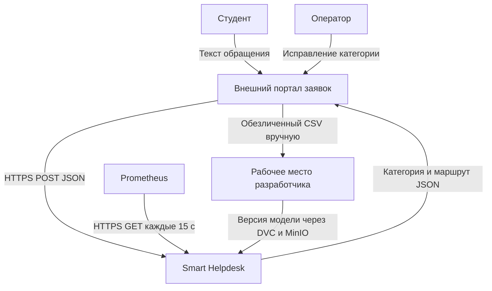
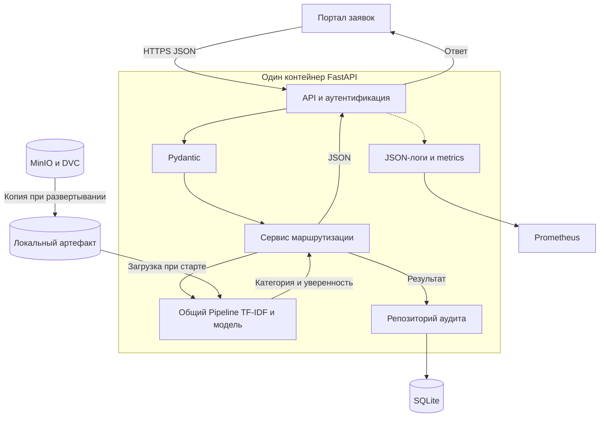

# Архитектура Smart Helpdesk

Полная спецификация — в [README.md](../README.md).

```mermaid
flowchart TB
    Student["Студент"] -->|"Текст обращения"| Portal["Внешний портал заявок"]
    Operator["Оператор"] -->|"Исправление категории"| Portal
    Portal -->|"HTTPS POST JSON"| System["Smart Helpdesk"]
    System -->|"Категория и маршрут JSON"| Portal
    Monitor["Prometheus"] -->|"HTTPS GET каждые 15 с"| System
    Portal -->|"Обезличенный CSV вручную"| Train["Рабочее место разработчика"]
    Train -->|"Версия модели через DVC и MinIO"| System
```

```mermaid
flowchart TB
    Client["Портал заявок"] -->|"HTTPS JSON"| API
    subgraph App["Один контейнер FastAPI"]
        API["API и аутентификация"] --> Valid["Pydantic"]
        Valid --> Service["Сервис маршрутизации"]
        Service --> Pipeline["Общий Pipeline TF-IDF и модель"]
        Pipeline -->|"Категория и уверенность"| Service
        Service -->|"Результат"| Repo["Репозиторий аудита"]
        Service -->|"JSON"| API
        API -.-> Obs["JSON-логи и metrics"]
    end
    API -->|"Ответ"| Client
    Repo --> DB[("SQLite")]
    Registry[("MinIO и DVC")] -->|"Копия при развертывании"| Local[("Локальный артефакт")]
    Local -->|"Загрузка при старте"| Pipeline
    Obs --> Prom["Prometheus"]
```
